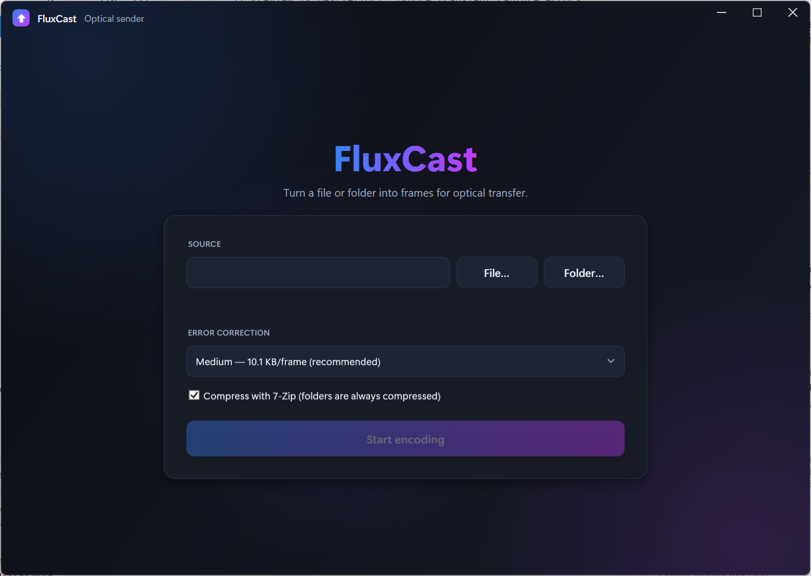
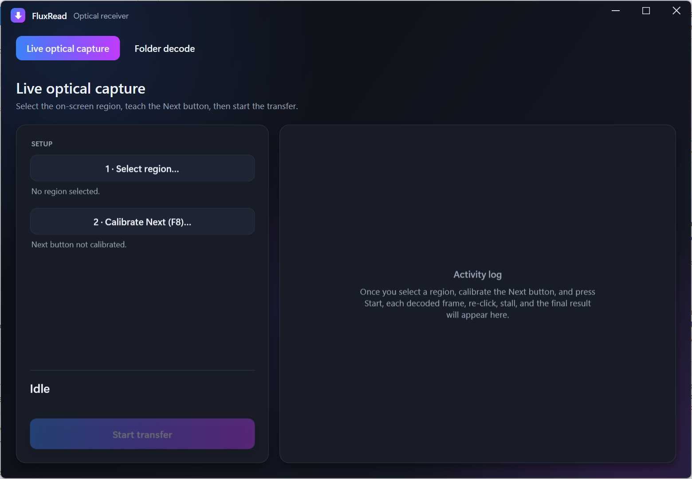
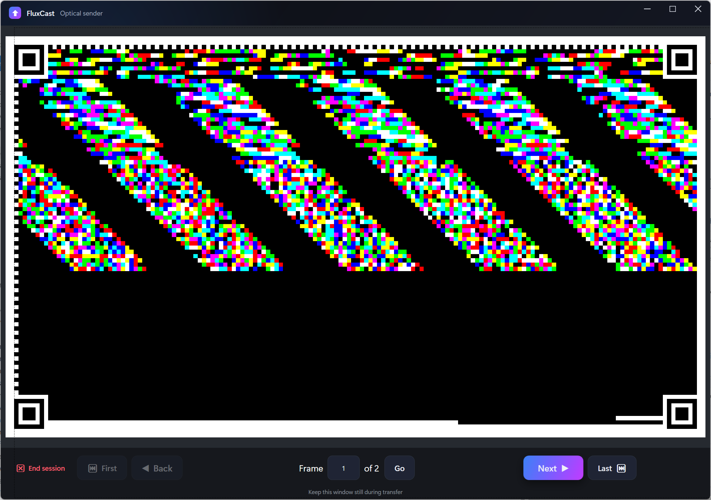
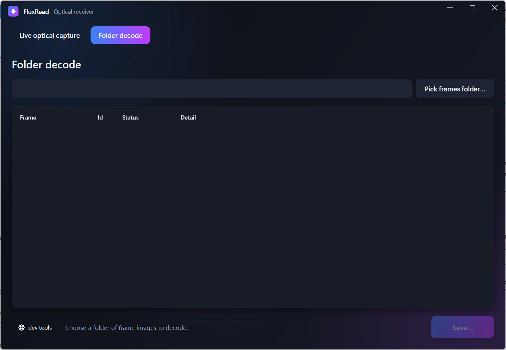

# Flux — an optical data channel

Flux transfers a file or folder over a **display-only link**: it renders the data as a stream of
error-corrected, colored-tile frames on one screen, and a second program reads them back with
computer vision — with no network, clipboard, USB, or shared filesystem between the two sides.
Every transfer is verified end to end by SHA-256.

It's a systems + computer-vision project: a QR-style frame format with corner fiducials and
homography-based registration, Reed–Solomon error correction over GF(256), a capture-tolerant
decoder that survives scaling / offset / screen recompression, and a manual-advance capture loop.

**Where it's useful:** one-way ("data-diode"-style) transfer between isolated environments,
moving your *own* files off a screen-only or air-gapped setup, and research into visual/optical
data channels. Please use it only for your own data, on systems you're authorized to use.

It is two Windows (WPF) apps over a shared, UI-agnostic core:

- **FluxCast** (sender) — runs on the source machine. Pick a file/folder → 7z-compress →
  encode to frames → display them one at a time with large **Back / Next** buttons.
- **FluxRead** (receiver) — runs on the destination machine. Either decode a folder of exported
  frame PNGs, or watch the FluxCast window on screen: capture → decode → advance → confirm the
  frame id incremented → repeat → reassemble → verify → save.
- **FluxCore** — shared library: frame format, Reed–Solomon ECC, palette/rendering, capture-
  tolerant decoder, compression, hashing, and the optical capture-loop state machine. No UI or
  Win32 dependencies; the Windows-specific capture code lives in FluxRead.

Targets **.NET 10** (Windows). Windows-only by design — screen capture and the automated
frame-advance (via the OS input APIs) are Windows-specific.

Both apps share a modern dark interface: custom borderless window chrome with Windows 11 rounded
corners, a blue→violet→magenta spectrum accent, animated window transitions (open / maximize /
minimize / close), and distinct per-app icons (▲ send / ▼ receive).

---

## Screenshots

<table>
  <tr>
    <td width="50%" valign="top">
      <br/>
      <sub><b>FluxCast · setup</b> — pick a file or folder, choose an ECC level, start encoding.</sub>
    </td>
    <td width="50%" valign="top">
      <br/>
      <sub><b>FluxRead · live capture</b> — select the region, calibrate Next, then transfer.</sub>
    </td>
  </tr>
  <tr>
    <td width="50%" valign="top">
      <br/>
      <sub><b>FluxCast · presenter</b> — one pixel-exact frame at a time with manual navigation.</sub>
    </td>
    <td width="50%" valign="top">
      <br/>
      <sub><b>FluxRead · folder decode</b> — decode a folder of frames with a per-frame results grid.</sub>
    </td>
  </tr>
</table>

---

## Frame format (FFv2)

Every frame is a fixed **160 × 90 tile** grid, each tile **8 × 8 px**, with a 16 px white quiet
zone — a canonical **1312 × 752 px** PNG rendered without antialiasing (one tile = one flat
color block).

- **Corner finder patterns** — four QR-style 7×7 concentric squares (1:1:3:1:1 scanline
  profile). The decoder locates them by run-length scan and builds a homography, so captures
  that arrive scaled, offset, or rotated still register.
- **Timing patterns** — alternating black/white tiles along the top row and left column;
  verify the homography and resolve orientation (including a 180° flip).
- **Header** — a 16-byte frame header (format version, frame id, total frames, per-frame
  payload length, payload CRC-32, ECC level) stored as **three redundant RS(48,16) copies** in
  spatially diverse positions. The Server confirms a click worked by the decoded frame id
  incrementing — never a timer.
- **Beacon** — a 4×4 block that flips black/white with frame-id parity, a cheap "frame changed"
  cue for the capture loop.
- **Data** — the remaining **13,515 tiles = 53 × 255** carry the payload as 53 interleaved
  RS(255,k) codewords (stride-53, so a smeared region spreads across all codewords).

### Colors

- **Payload frames** use `ColorMap.Default`: a fixed **256-color** palette (1 byte/tile), an
  evenly spaced 8×8×4 RGB lattice with a minimum pairwise distance of 36 — chosen so tiles stay
  classifiable under lossy screen recompression. White is reserved for null/structural tiles.
- **Frame 0** (metadata) uses only the **8 RGB cube corners** (black/red/green/blue/cyan/
  yellow/magenta/white) at 3 bits/tile, decoded by a simple per-channel threshold (minimum
  distance 255). This makes the bootstrap frame maximally robust and palette-independent, while
  still carrying the full transfer metadata (SHA-256, name, sizes, ECC level, embedded palette).

### ECC levels (per-frame payload capacity)

| Level | Codeword | Corrects/codeword | Payload/frame |
|---|---|---|---|
| Low | RS(255,223) | 16 (6.3%) | 11,819 B |
| **Medium (default)** | RS(255,191) | 32 (12.5%) | 10,123 B |
| High | RS(255,159) | 48 (18.8%) | 8,427 B |
| Max | RS(255,127) | 64 (25%) | 6,731 B |

Frame 0 is always encoded at Max. The codec is pinned by a permanent golden round-trip +
degradation test suite: Medium survives JPEG q85 and High survives q75 at 0.8×/1.0×/1.25×
scale; beyond that it fails cleanly (CRC), never silently corrupts.

---

## Using it

### Send (FluxCast, on the source machine)
1. Pick a file or folder; review the size/type/estimated-frame summary.
2. Choose an ECC level (Medium by default) and whether to compress.
3. **Start encoding** — a resumable session is written to
   `%LOCALAPPDATA%\Flux\FluxCast\sessions\{signature}\` (re-running the same source resumes).
4. Present the frames full-window and advance with **Next** (First / Last / go-to-frame also
   available). Do not move or resize the window during a transfer.

### Receive (FluxRead, on the destination machine)

**Folder decode** (also the codec quality gate): point it at a folder of `frame_NNNNNN.png`
files → it decodes every frame, shows a per-frame results grid, reassembles, verifies SHA-256,
and saves (raw → file, 7z → extracted folder).

**Live optical capture:**
1. **Select region** — drag a rectangle around FluxCast's frame area (generous margins are fine;
   the fiducials handle registration).
2. **Calibrate Next (F8)** — hover over FluxCast's Next button and press F8 to record its point.
3. **Start** — FluxRead loops: capture → decode → click Next → confirm the frame id advanced →
   repeat until complete, then reassembles, verifies, and saves. If it stalls, it asks you to
   Retry / Recalibrate / Abort rather than spinning forever.

---

## Build & test

```
dotnet build Flux.sln
dotnet test FluxCore.Tests/FluxCore.Tests.csproj
```

External **7-Zip** (`7z.exe`) is used for compression when available; otherwise Flux falls back
to the bundled SharpCompress. Both apps declare Per-Monitor-V2 DPI awareness so screen
coordinates are physical pixels.

## Project layout

- `FluxCore/` — `Framing/` (format, header, encoder), `Ecc/`, `Imaging/` (palette, renderer,
  cube-corner colors), `Decoding/` (fiducials, homography, sampler, decoder, assembler),
  `Compression/`, `Hashing/`, `Transfer/` (content signature, encode service, capture loop).
- `FluxCore.Tests/` — 230+ xUnit tests incl. the golden round-trip and degradation matrix.
- `FluxCast/` — WPF sender (setup / progress / presenter).
- `FluxRead/` — WPF receiver (folder-decode + live optical; `Interop/` holds the Win32 capture,
  click, DPI, hotkey, and window-placement helpers).

## Accepted v1 limitations

- FluxRead has no cross-restart resume (a killed transfer restarts from frame 0).
- Windows-only.
- Fixed grid, palette, and render scale — no adaptive sizing.
