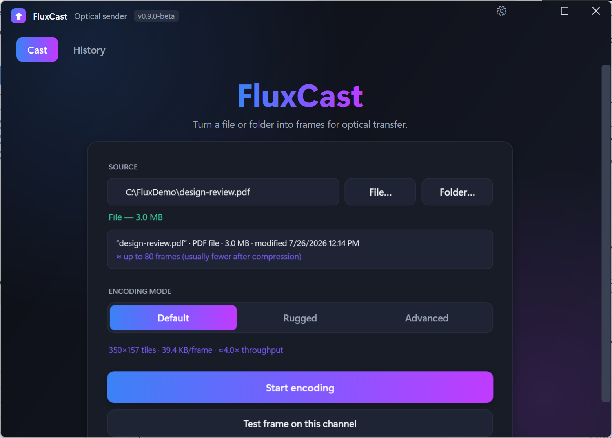
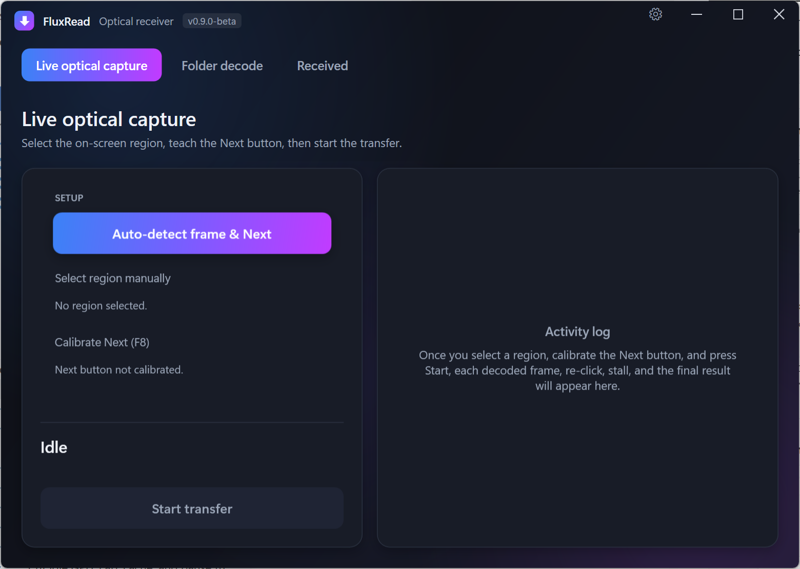
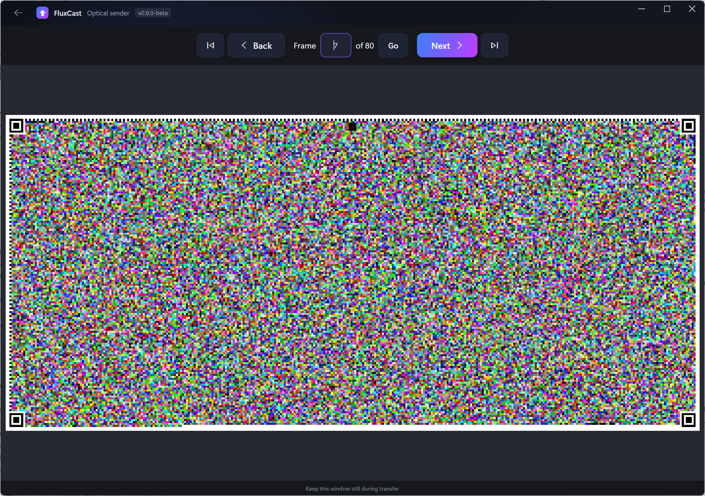
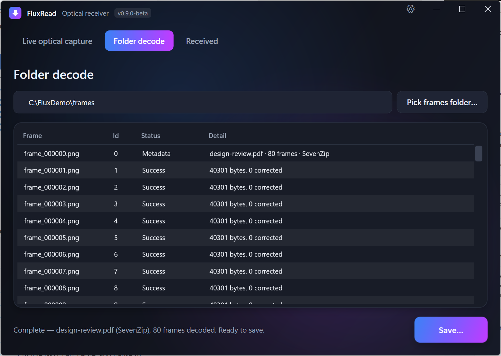

# Flux — an optical data channel

Flux transfers a file or folder over a **display-only link**: it renders the data as a stream of
error-corrected, colored-tile frames on one screen, and a second program reads them back with
computer vision — with no network, clipboard, USB, or shared filesystem between the two sides.
Every transfer is verified end to end by SHA-256.

It's a systems + computer-vision project: a QR-style frame format with corner fiducials and
homography-based registration, Reed–Solomon error correction over GF(256), a capture-tolerant
decoder that survives scaling / offset / screen recompression, and a manual-advance capture loop.

**Where it's useful:** one-way ("data-diode"-style) transfer between isolated environments,
moving your *own* files off a screen-only or air-gapped setup, and research into visual/optical
data channels. Please use it only for your own data, on systems you're authorized to use.

It is two Windows apps in WinUI 3 over a shared, UI-agnostic core:

- **FluxCast** (sender) — runs on the source machine. Pick a file/folder → 7z-compress →
  encode to frames → display them one at a time with large **Back / Next** buttons.
- **FluxRead** (receiver) — runs on the destination machine. Either decode a folder of exported
  frame PNGs, or watch the FluxCast window on screen: capture → decode → advance → confirm the
  frame id incremented → repeat → reassemble → verify → save.
- **FluxCore** — shared library: frame format, Reed–Solomon ECC, palette/rendering, capture-
  tolerant decoder, compression, hashing, and the optical capture-loop state machine. No UI or
  Win32 dependencies; the Windows-specific capture code lives in FluxRead.

Targets **.NET 10** (Windows). Windows-only by design — screen capture and the automated
frame-advance (via the OS input APIs) are Windows-specific.

Both apps share one interface library: a custom title bar over the window's own Windows 11 chrome,
a blue→violet→magenta spectrum accent, light / dark / system theming that switches live,
animated window and view transitions, a reduce-motion performance mode, taskbar progress, and
distinct per-app icons (▲ send / ▼ receive).

---

## Screenshots

<table>
  <tr>
    <td width="50%" valign="top">
      <br/>
      <sub><b>FluxCast · setup</b> — pick a source, choose a mode, read the fitted grid and
      throughput, start encoding.</sub>
    </td>
    <td width="50%" valign="top">
      <br/>
      <sub><b>FluxRead · live capture</b> — select the region, calibrate Next, then transfer.</sub>
    </td>
  </tr>
  <tr>
    <td width="50%" valign="top">
      <br/>
      <sub><b>FluxCast · presenter</b> — one pixel-exact frame at a time with manual navigation.</sub>
    </td>
    <td width="50%" valign="top">
      <br/>
      <sub><b>FluxRead · folder decode</b> — decode a folder of frames with a per-frame results
      grid, then verify and save.</sub>
    </td>
  </tr>
</table>

---

## Frame format (FFv3)

A frame is a grid of flat colored tiles inside a white quiet zone, rendered without antialiasing
(one tile = one flat color block). **The grid, tile size, and palette are per-transfer settings**:
FluxCast fits the grid to the sender's display at the chosen tile size, writes the geometry into
frame 0, and the receiver adopts whatever frame 0 declares. The legacy fixed geometry — **160 × 90
tiles at 8 px**, a 1312 × 752 px PNG — remains the default payload layout; frame 0 has its own
smaller fixed grid (below), the bootstrap anchor.

- **Corner finder patterns** — four QR-style 7×7 concentric squares (1:1:3:1:1 scanline
  profile). The decoder locates them by run-length scan and builds a homography, so captures
  that arrive scaled, offset, or rotated still register.
- **Timing patterns** — alternating black/white tiles along the top row and left column;
  verify the homography and resolve orientation (including a 180° flip).
- **Header** — an 18-byte frame header (format version, frame id, total frames, per-frame
  payload length, payload CRC-32, ECC level) stored as **three redundant RS(48,18) copies** in
  spatially diverse positions. Its tile footprint follows the palette depth — 48 tiles per copy at
  256 colors and above, 128 at the 3-bit rugged tier. The receiver confirms a Next click worked by
  the decoded frame id incrementing — never a timer.
- **Beacon** — a 4×4 block that flips black/white with frame-id parity, a cheap "frame changed"
  cue for the capture loop.
- **Data** — every remaining tile carries the payload as interleaved RS(255,k) codewords (stride =
  the codeword count, so a smeared region spreads across all codewords). At the default grid that
  is **13,515 tiles = 53 × 255**.

### Colors

Payload frames use a palette **generated deterministically from a color count and kind** — frame 0
carries only those two values and both sides regenerate the identical palette, so no color list
ever crosses the channel. White is reserved for null/structural tiles, and the decoder's confidence
gate scales to the palette's actual minimum distance.

| Tier | Bits/tile | Min RGB distance | Channel it needs |
|---|---|---|---|
| Rugged grayscale-8 | 3 | ≈54, pure luma | survives chroma-lossy links (RDP, 4:2:0) |
| **256 (default)** | 8 | 36 | any channel |
| 512 | 9 | ≈26 | clean channel |
| 1024 | 10 | ≈17 | near-pixel-perfect only |

The rugged tier is eight grays on an even luma ladder: screen codecs preserve luma and wreck
chroma, so a palette that differs *only* in luma loses nothing to chroma subsampling.

**Frame 0** (metadata) is fixed and never follows these settings — it is a **96 × 54 grid encoded
in pure black/white** (1 bit/tile, an 800 × 464 px PNG), decoded by a single adaptive luma
threshold, with the ~250 bytes of metadata protected by two half-rate RS(255,127) codewords. Mono
because frame 0 must survive the worst channel any payload tier targets — a grayscale or
chroma-destroying link that the rugged tier handles cannot be allowed to kill the frame that
bootstraps it. It carries the transfer metadata (SHA-256, name, sizes, ECC level, grid, tile size,
color count, palette kind, and a metadata-frame count reserved for future multi-frame metadata).
From v5 on the metadata is versioned append-only, so future fields extend it without breaking
older readers; the redesign itself is the one wire break, worth a line in the next release notes.

### ECC levels (per-frame payload capacity)

| Level | Codeword | Corrects/codeword | Payload/frame |
|---|---|---|---|
| Low | RS(255,223) | 16 (6.3%) | 11,819 B |
| **Medium (default)** | RS(255,191) | 32 (12.5%) | 10,123 B |
| High | RS(255,159) | 48 (18.8%) | 8,427 B |
| Max | RS(255,127) | 64 (25%) | 6,731 B |

Payload/frame is quoted at the default 160 × 90 grid with 256 colors; a display-fitted grid and a
denser palette scale it up (on a 1440p screen, standard 8 px tiles at 1024 colors run ≈5× the
legacy capacity). Frame 0 is always encoded at Max. The codec is pinned by a permanent golden
round-trip + degradation test suite: Medium survives JPEG q85 and High survives q75 at
0.8×/1.0×/1.25× scale; beyond that it fails cleanly (CRC), never silently corrupts.

### Throughput vs. robustness

Three independent levers multiply, and all three ride in frame 0: **grid size** (the biggest —
scales with the sender's display), **ECC level** (Low carries ~75% more than Max), and **color
depth** (+12.5% at 512, +25% at 1024). The fast settings trade away error margin, so FluxCast
prints a live capacity/robustness readout, offers only color-and-tile combinations the display can
actually present at ~1:1, and ships a **Test frame on this channel** button that sends a throwaway
two-frame transfer at the chosen settings so you can confirm it reads before committing to a long
one.

---

## Using it

### Send (FluxCast, on the source machine)
1. Pick a file or folder (or drop one in); review the size/type/estimated-frame summary.
2. Pick a mode — **Default** (Medium ECC, standard 8 px tiles, 256 colors), **Rugged** (High ECC,
   large 12 px tiles, grayscale-8; for RDP and other lossy links), or **Advanced**, which exposes
   the ECC / tile-size / palette / compression levers individually.
3. Optionally hit **Test frame on this channel** and read it with FluxRead before committing.
4. **Start encoding** — a resumable session is written under
   `%LOCALAPPDATA%\Flux\FluxCast\sessions\` (re-running the same source resumes; re-rendering the
   same content at different settings reuses the compressed payload).
5. Present the frames full-window and advance with **Next** (First / Last / go-to-frame also
   available). Do not move or resize the window during a transfer.

**Recent casts** lists past sessions, clusters the render variants of the same content, and can
re-present one or **export its frames** to a folder.

### Receive (FluxRead, on the destination machine)

**Folder decode** (also the codec quality gate): point it at a folder of `frame_NNNNNN.png`
files → it decodes every frame, shows a per-frame results grid, reassembles, verifies SHA-256,
and saves (raw → file, 7z → extracted folder).

**Live optical capture:**
1. **Select region** — drag a rectangle around FluxCast's frame area (generous margins are fine;
   the fiducials handle registration).
2. **Calibrate Next (F8)** — hover over FluxCast's Next button and press F8 to record its point.
3. **Start** — FluxRead reads the settings off frame 0, then loops: capture → decode → click Next
   → confirm the frame id advanced → repeat until complete, then reassembles, verifies, and saves.
   A compact always-on-top mini window takes over during the transfer so a single screen can show
   both apps, and a per-frame quality readout reports clean / marginal / low-confidence captures.
   Failures are diagnosed, not guessed at: a blocked Next button, an ineffective click, an
   unreadable frame, and a missing frame each get a few automatic recalibration retries, then a
   cause-specific prompt — Try again / Manual calibration / Stop (received frames are kept).

An interrupted reception is kept: the **Received** list offers to resume it, and FluxRead
fast-forwards to the first missing frame instead of restarting.

---

## Build & test

The apps need Visual Studio's MSBuild — the Windows App SDK's PRI task does not ship with the
.NET SDK, so `dotnet build` cannot build them. Run Restore and Build as two invocations:

```
& "C:\Program Files\Microsoft Visual Studio\18\Community\MSBuild\Current\Bin\amd64\MSBuild.exe" `
    Flux.sln /t:Restore /p:Configuration=Debug /p:Platform=x64
& "C:\Program Files\Microsoft Visual Studio\18\Community\MSBuild\Current\Bin\amd64\MSBuild.exe" `
    Flux.sln /t:Build /p:Configuration=Debug /p:Platform=x64
```

The core and its tests need no Visual Studio:

```
dotnet build FluxCore/FluxCore.csproj
dotnet test FluxCore.Tests/FluxCore.Tests.csproj
```

External **7-Zip** (`7z.exe`) is used for compression when available; otherwise Flux falls back
to the bundled SharpCompress. Both apps declare Per-Monitor-V2 DPI awareness so screen
coordinates are physical pixels.

## Project layout

- `FluxCore/` — `Framing/` (format, parametric layout, header, encoder), `Ecc/`, `Imaging/`
  (palette generator, renderer, mono bootstrap colors), `Decoding/` (fiducials, homography, sampler,
  decoder, assembler), `Compression/`, `Hashing/`, `Transfer/` (content signature, encode service,
  capture loop).
- `FluxCore.Tests/` — 371 xUnit tests incl. the golden round-trip and degradation matrix.
- `Flux.Ui/` — the shared interface library: the single theme, transitions, motion and theme
  settings, dialogs, and the views both apps embed.
- `FluxCast/` — the sender (setup / progress / presenter / recent casts).
- `FluxRead/` — the receiver (folder-decode + live optical + received items; `Interop/` holds
  the Win32 capture, click, DPI, hotkey, region-overlay and window-placement helpers).
  `PORT-NOTES.md` there records the WinUI mechanisms and the traps behind them.

## Accepted v1 limitations

- Windows-only.
- A transfer's settings are fixed once encoding starts — changing the grid, palette, or ECC level
  re-renders the session and is a new transfer to the receiver, never a resume.
- The 512- and 1024-color tiers and the rugged tier are validated by unit tests over clean and
  simulated-lossy channels; end-to-end runs over a real RDP link are still manual acceptance work.

## Responsible use

Flux is a research and engineering project in error-corrected visual data channels. Use it only to
move **your own data**, on systems and networks you own or are explicitly authorized to use. Don't
use it to move data in violation of an organization's security or acceptable-use policy, or the
law. The channel is deliberately **manual and low-bandwidth** — it exists to explore optical data
transfer and computer-vision decoding, not to defeat controls.
